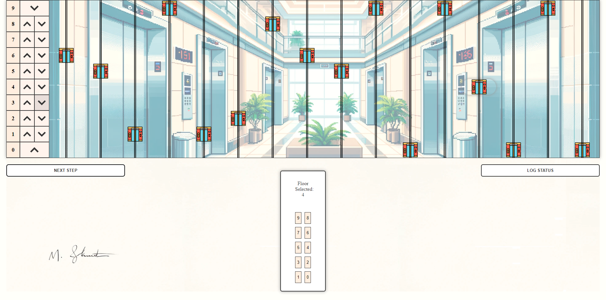

# Elevator System Control Panel


## Table of Contents

- [Elevator System Control Panel](#elevator-system-control-panel)
    - [Table of Contents](#table-of-contents)
    - [Project Overview](#project-overview)
    - [Features](#features)
    - [Prerequisites](#prerequisites)
    - [Installation](#installation)
    - [Usage](#usage)
    - [API Endpoints](#api-endpoints)
    - [Technologies Used](#technologies-used)

## Project Overview

This project simulates an elevator system.
It uses Spring Boot to handle backend logic and REST APIs, and a frontend built with HTML, CSS, and JavaScript to interact with the system.
It also has console logging system implemented and error handling.

## Features

- 16 elevators
- Floor request handling
- Directional request handling
- Real-time elevator status updates
- Possibility to set the floor from within the elevator by clicking on elevator icon

## Prerequisites

Before you begin, ensure you have the following installed:

- Java JDK 8 or higher
- Node.js and npm (for frontend dependencies)

## Installation

1. Clone the repository:

    ```sh
    git clone https://github.com/MSkrobot/elevator-system.git elevator-system
    ```

2. Navigate to the project directory and run the Spring Boot application:

    ```sh
    cd elevator-system
    ./gradlew bootRun
    ```

3. Open `index.html` in your browser to use the frontend.

## Usage

1. The application should be running on `http://localhost:8080`.
2. Use the GUI to call elevators and set destinations.

## API Endpoints

- `GET /api/elevators/status`: Get the status of all elevators
- `POST /api/elevators/pickup`: Request an elevator pickup
- `POST /api/elevators/step`: Advance the state of the elevator system
- `POST /api/elevators/set-destination`: Set the destination floor for an elevator

## Technologies Used

- Java
- Spring Boot
- HTML
- CSS
- JavaScript
- REST
